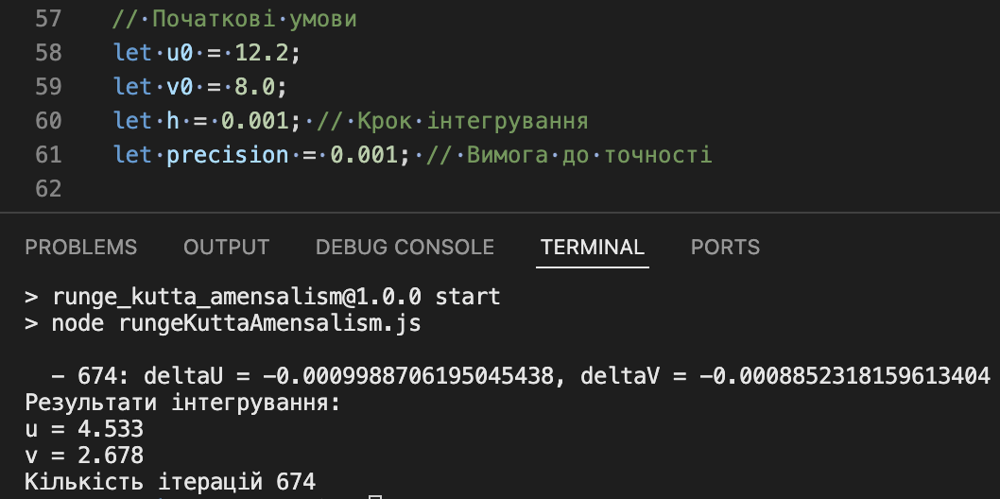

Знайти стани рівноваги ДС та встановити їх тип.

## Постановка задачі

### Опис моделі аменсалізму

**Аменсалізм** — це форма біотичних взаємовідносин між організмами, за яких один вид (аменсал) пригнічує життєдіяльність
іншого виду, але при цьому не відчуває негативного або позитивного впливу у відповідь.

### Математична модель

Математична модель аменсалізму із конкуренцією всередині популяцій та міграцією у популяцію аменсала та з другої
популяції із постійними швидкостями \( m_1 \) та \( m_2 \) має вигляд:

\[
\frac{du}{dt} = -m_1 + a_1 u - b_{12} u v;
\]
\[
\frac{dv}{dt} = m_2 \sin(\omega v) + a_2 v - c_2 v^2;
\]

де:
- \( u \) — популяція аменсала,
- \( v \) — популяція другого виду,
- \( m_1 \), \( m_2 \) — швидкості міграції,
- \( a_1 \), \( a_2 \) — коефіцієнти зростання популяцій,
- \( b_{12} \) — коефіцієнт впливу популяції \( v \) на популяцію \( u \),
- \( c_2 \) — коефіцієнт самоконкуренції в популяції \( v \),
- \( \omega \) — частота коливань у популяції \( v \).

### Початкові умови та параметри

Наведені початкові умови та параметри:

- \( m_1 = 1.088 \),
- \( a_1 = 3.1 \),
- \( b_{12} = 1.15 \),
- \( m_2 = 1.896 \),
- \( \omega = 0.654 \),
- \( a_2 = 1.25 \),
- \( c_2 = 0.85 \),
- Початкові значення: \( u = 12.2 \), \( v = 8.0 \).

### Завдання

Знайти координати стану рівноваги співіснування популяцій із точністю до **0.001**.

### Відповідь

